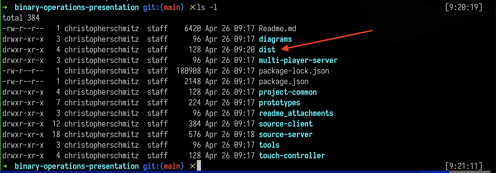
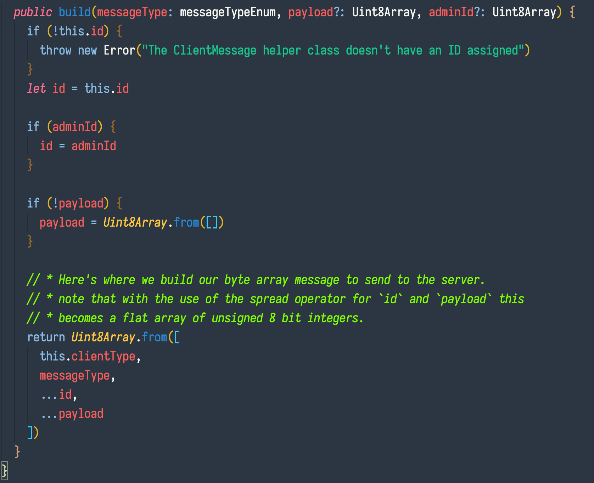
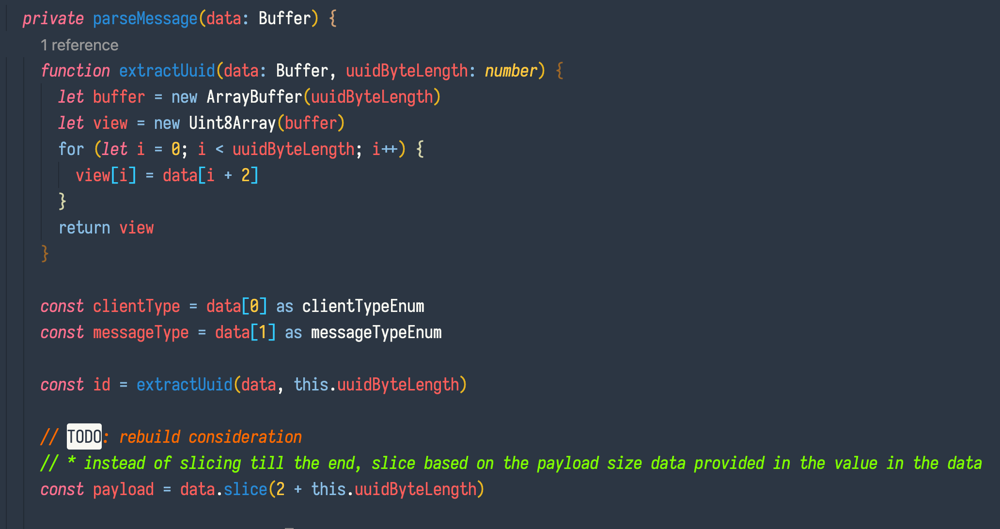
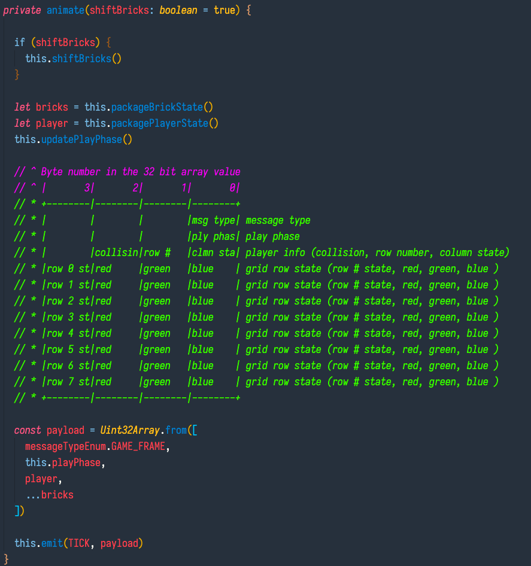
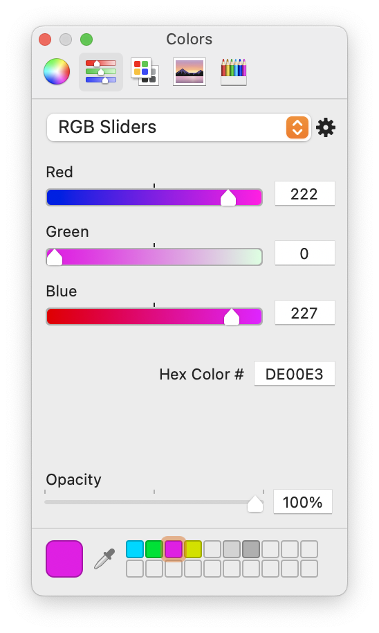

# Multi player brick game

A websocket driven multi-player game where one player tries to avoid bricks sent down rows buy one to eight other players.


# The gist

I want to give a couple of meetup talks centered around number systems in computers (binary, hex, how they're used), websockets, arduino, 3d modeling/printing. I like being able to use practical demos as examples for talks so I thought I'd create a simple game that threads the needles for all of those topics.

The game is a super simple avoidance game. It uses websockets to facilitate the communication between the game controllers, the server, and the game boards. The message payloads are all bit arrays, either 8 bit or 32 bits.

# Up and running

Here's how to get up and running with this codebase. Before we go over the steps, there are a couple of things that are assumed:

- You have nodejs installed. I'm running version 15.9.0, though I imagine this would also run on older versions. You can install node (which comes bundled with npm) from:
  - [The official nodejs site](https://nodejs.org/en/download/)
  - Using [Node Version Manager](https://github.com/nvm-sh/nvm#installing-and-updating) which allows for easy switching between versions
- You have the version control tool [git](https://git-scm.com/book/en/v2/Getting-Started-Installing-Git) installed

Also, I don't have a windows computer so I'm not sure how many of these notes would need to be adjusted for a windows user :grimace:

## Installation

Pop open a terminal, `cd` to whatever directory you want to install the code base in, and type in:

```sh
git clone https://github.com/chris-schmitz/binary-operations-presentation
cd binary-operations-presentation
npm run install:all
npm run build
```

At this point if you run an `ls -l` you should notice a `dist` directory



## Launching the project

Once the `dist` directory is built you can launch the project. Note that unless you're adjusting the source code you don't need to rebuild the `dist` directory between launches.

There's a lot to get done to get this whole project up and running. I got irritated by this so I boiled it down to a couple of npm scripts:

```sh
npm start # This will launch the server
open http://localhost:3000

# The player controller requires an ID that has to come from the server, to get it run the following command:
npm run game:print-player-id

# Also, once the game has finished, you can restart it by running the command:
npm run game:restart

# Note that after you restart the game you'll need to print a new player id
```

# A note about ... the cruft

This codebase is wasn't rushed, it was much the opposite. I wrote this codebase over the course of months in ~45 minute daily sprints (the time between helping get the family squared away for the day and starting work). Because of this there's a low of code sprawl, things that should be refactored, and a variety of approaches and styles all lumped together based on where my mind was at on a particular day.

So, keep that in mind as you dig through the code. It's not an apology, just a "when you look at a particular section of code and interrobang, that may be why".

# A note about "security" in this project

The security is _light_ in this demo. Really, it's there to make sure people can't grab controllers or send commands to rows that their controller isn't registered for. All of the IDs and passwords (outside of the controller page passwords) are just 4 byte arrays. I'm not even hosting this demo with an TLS certificate because I want participants to be able to pop up wireshark and see the data payloads unencrypted.

There's no real reason to add in tighter security for this demo, but I want to call this out because I don't want anyone looking to this project as a way of securing a project.

---

# The payloads

The main reason I built this codebase is to use it as a practical talking point for number formats (e.g. binary, hex, etc) and common practices around using specific formats. Because of this, and to facilitate low-latency/high-frequency communication all of the data payloads coming from and being sent to the server are bit arrays.

## Controller clients -> Server payloads

The controller clients send simple byte array data payloads to the server for their commands. These payloads consist of a couple of meta data bytes and an optional payload:

```
[
  CLIENT TYPE, // * the clientTypeEnum value for the particular client type
  MESSAGE TYPE, // * the messageTypeEnum denoting the type of message being sent
  ID BYTE 1, // * A randomly generated 4 byte ID
  ID BYTE 2,
  ID BYTE 3,
  ID BYTE 4,
  OPTIONAL DATA, // * any accompanying data (e.g. the brick color to use for a send brick command)
  ...
]
```

You can see how this message is built in the [source-client/common/ClientMessageBuilder.ts method `build`](source-client/common/ClientMessageBuilder.ts), which all of the client controllers use to message the server.



You can see how the server parses the messages in [/source-server/managers/WebsocketServer.ts method `parseMessage`](./source-server/managers/WebsocketServer.ts)



Messages from the Server back down to controller clients is in the same byte array shape, but with just the data that the client needs (i.e. no payload and now client type).

Something worth considering in future projects is to add in a payload length byte so we can validate the data we're getting and potentially add more data after the payload if that's called for.

## Server -> gameboards

The message payloads that the server sends to the gameboards is a bit different than the messages between the server and the client controllers. We are sending down "game frames" of information. These frames are the animation frames that the gameboards should render out.

We want the gameboards to render these frames out as fast as possible. The brick animation interval is pretty slow (as far as rendering goes). If the player isn't moving the bricks only come down every 500 milliseconds (half a second). This is plenty of time for the server to emit a websocket message with the current frame and for the gameboards to render it out.

That said, the player has unimpeded movement with no delay aside from network latency and server render speed. When the player moves, the game frames are calculated and immediately sent to all of the gameboards. If the player quickly moves three blocks, those 3 game frames are rendered out asap and sent down to the boards to render.

So, to be able to render out these frames quickly without running behind (render lags behind messages) or skipping frames we send down a 32 bit array of data that the gameboards use to render the frame. The payload is built up in the [source-server/managers/GameManager.ts `animate` method](source-server/managers/GameManager.ts):



### Game Frames as 32 bit array payloads

Something worth noting is the reasoning behind the choice to use a 32 bit array to store the game frame vs a byte array (8 bit).

The brick controllers are ... pretty boring. I mean it's cool, but all you're doing is hitting a button to send a brick down a row. To make it a bit more interesting and to take advantage of the RGB LED matrix I decided to allow people with brick controllers to control the color of the brick. This means that the brick controller needs to send the RGB value to the server and that in turn needs to be relayed down to the gameboards. Let's look at row information in the game frame (starting at the 4th row in the game frame):

We could 100% send this down in a byte array for each row, but it would make for some awkward parsing.

```
[
  row 1 state,
  row 1 red value,
  row 1 green value,
  row 1 blue value,
  row 2 state,
  row 2 red value,
  row 2 green value,
  row 2 blue value,
  ...
]
```

We would need to have a nested loop to extract each value per row, or we'd need to send it down in a different format like json so we could have nested objects. The json would be easier for a human to read, but we're wanting low latency when it comes to rendering the frames out.

It would be much easier to send the row data as a 32 bit number.That way all of the information needed for a row can be encapsulated in one number:

```
01000000 11011110 00000000 11100011
```

I put a space after every 8th digit so we could see the byte groupings (byte == 8 bits), but in realty this number would be one contiguous value (`01000000110111100000000011100011`)

Let's look at this number from left to right, byte by byte.

We're using the first byte to represent a row's state:

```
01000000
```

So we're saying "out of the 8 cells in this row, light up the second cell from the left".

The remaining 3 bytes tell us the Red Green and Blue color values to use when lighting up those cells:

```
11011110 == Red
00000000 == Green
11100011 == Blue
```

In hex, this number is 0xDE00E3 which is a magenta-ish color:



So, instead of a nested loop, we can just loop over each number and pull apart the bytes via bitwise comparisons and bit shifting:

```javascript
// a bit of psudo code:

let row = gameFrame[3] // Our 32 bit number: 01000000110111100000000011100011

const blue = 0xff & row // grabing the right most byte: blue == 11100011
row >>= 8 // shifting our number to the right by 8 bits: 010000001101111000000000

// Note that 0x denotes a base 16 number, 0b a base 2 number, so 0xFF == 0b11111111 == 255
// So when we're doing the bitwise comparisons, we can use any of the different forms of our mask

const green = 255 & row // grabing the right most byte: green == 00000000
row >>= 8 // shifting our number to the right by 8 bits: 010000001101111

// It's actually easier to understand bit masking when you look at the binary version
// A bitwise `AND` operation just says "look at these two numbers and compare each numbers bit with an AND"
// so something like `0b101 & 0b111` would equal `0b101` because only the first and third value of each number is
// `1`. If we have an unknown binary number `0bXXXXXXXX`, we want to figure out what the 8 bits are, and
// we know the only possible values are `0` and `1`, we can use a bit mask of `0b11111111` with an AND comparison.
// Only the values from our unkwown number will come through as 1.

const green = 0b11111111 & row // grabing the right most byte: green == 11011110
row >>= 8 // shifting our number to the right by 8 bits: 01000000

// and now all that is left in the number is the 8 bits representing our state
const state = row
```

Without all of the verbose rambling the code looks like this:

```javascript
let row = gameFrame[3]

const blue = 0xff & row
row >>= 8

const green = 255 & row
row >>= 8

const green = 0b11111111 & row
row >>= 8

const state = row
```

Now, all that our game frame parsing loop on the gameboard needs to do is walk down each brick row number, pull apart the number into bytes, and use those as instructions to light up the LED matrix or set the css for the grid on the webpage.

It's worth noting here that there is no branching logic here and no loop, this using math to pull apart the values. In terms of speed the computer or microcontroller can execute this non-branching logic faster than if it has to jump around the machine instructions because of a conditional or a loop.

## Exploring the data with Wireshark

[Wireshark](https://www.wireshark.org) is a tool that allows you to intercept and inspect network data packets.


It's a cool tool to use for poking around in general, but it's particularly helpful in this project.

All of the websocket data payloads going back and forth are sent in binary, which makes inspecting data hard using browser developer tools which are geared towards displaying text payloads.

E.g. you can't actually display the binary value 10101 to a console in it's binary form because the numbers `1` and `0` don't correspond to any character encoding values. You'd have to write the string version of 10101 which is 3130313031. Most dev tools make this easy, but the websocket inspection tool (at least in chrome) doesn't do this for you.

TODO: COME BACK AND CLEAN UP THIS WORDING

But, we can use wireshark to catch those packets and display the actual binary data:


# Future considerations

There a pretty strong chance that I won't spend much time updating this codebase after the talk, or at least if I do I'll likely not be keeping it as a muliplayer game. That said, if future me does return there are a couple of thoughts worth considering:

## Collision rendering on the server

Right now the gameboard clients are supposed to be dumb renderers, i.e. the only thing they should do is receive game frames, parse them so that they can be rendered, and then render then onto the screen or across the led strip.

This is done for everything but the collisions. The detection of collisions happens on the server, but the logic for determining how that should be rendered out is up to the gameboard.

I did it this way because the web gameboard has a variety of ways to show the collision that include the grid or areas around it (e.g. we could display a banner above the grid saying "hit", or play a sound, or shake the grid, etc), but on the physical LED matrix we're much more limited. The "space around the grid" is just literal reality. So, I left the method of rendering up to the board client itself.

This is fine, we do display collisions slightly differently on each board, but really I think the way the physical led matrix displays the collision (i.e. turning any unoccupied cell orange) probably works fine for both the physical and web gameboards. This means we could pull the logic of "how a collision affects the colors of the rest of the gameboard" up to the server, making the gameboard clients even dumber.

When I thought about this I almost sat down and started the logic migration, but there's another snag to consider: our game frames represent the state of _things on the gameboard_, but it doesn't represent the gameboard itself. That is, the frames don't contain color information for any non-occupied cell.

So, if we were going to set the color of the unoccupied cells on the server during a collision, we'd need to also set the color of the unoccupied cells all of the time. Really, this isn't a bad idea, and it would allow for the gameboards to truly match (right now everything matches except for unoccupied cells), but it's more work than what I feel like doing now.

## Dynamic grid size

My initial plan was to make the codebase completely adjustable as far as gameboard grid size so that it could accommodate any number of players and columns. You can see that in the original prototype and a bit in the final classes.

But, I decided part of the way through the build that I would hard code the gameboard to an 8x8 grid. This is primarily because I decided to build an RGB LED matrix to go with the game and it would be 8x8. It made the code a bit easier to write by hard coding it to 8x8. That said it would be really cool to make the codebase fully dynamic based on a project-common configuration that sets the grid size or by an adjustable parameter in the API.
